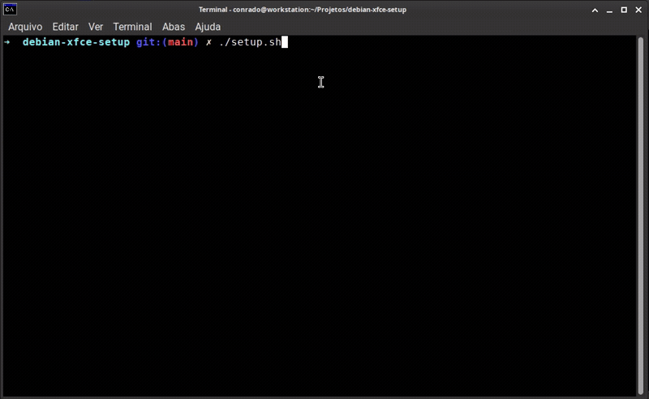

# Debian XFCE Setup

<p align="center">
  <strong>A small interactive setup script for turning a fresh Debian XFCE installation into a ready-to-use development environment.</strong>
</p>

<p align="center">
  <a href="https://www.debian.org/"></a>
  <a href="https://www.gnu.org/software/bash/"></a>
  
  
</p>

<p align="center">
  
</p>

## What it does

`Debian XFCE Setup` provides a `whiptail` interface where you choose exactly what you want to install or configure.

It can handle development tools, desktop applications, Docker, Zsh + Oh My Zsh, timezone/NTP, an optional X11 keyboard fix, Chicago95 integration, Inter font availability, and audio/microphone guidance.

The interface is available in **English** and **Portuguese**, selected manually on every run.

## Highlights

- Interactive and selective — run one task or use `ALL`.
- Java, Maven, Git, VS Code, IntelliJ IDEA and KeePassXC.
- Docker Engine + Compose + Buildx from Docker's official repository.
- Zsh + Oh My Zsh.
- Optional Chicago95 integration with project-controlled safeguards.
- Persistent X11/XFCE fix for `\\` and `|` on affected keyboards.
- Re-runnable: existing installations and managed configuration are detected where appropriate.

## Quick start

```bash
git clone https://github.com/conradomrosa/debian-xfce-setup.git
cd debian-xfce-setup
chmod +x setup.sh
./setup.sh
```

> Run it as a normal user — **do not use `sudo ./setup.sh`**.

## Documentation

This README is intentionally short.

For installation behavior, task details, managed files, limitations and security notes, see the **[full English documentation](DOCS-en.md)**.

Also available in **[Portuguese](DOCS.md)**.

---

<p align="center">
  <sub>Built for Debian + XFCE, with explicit choices and as little hidden behavior as possible.</sub>
</p>
